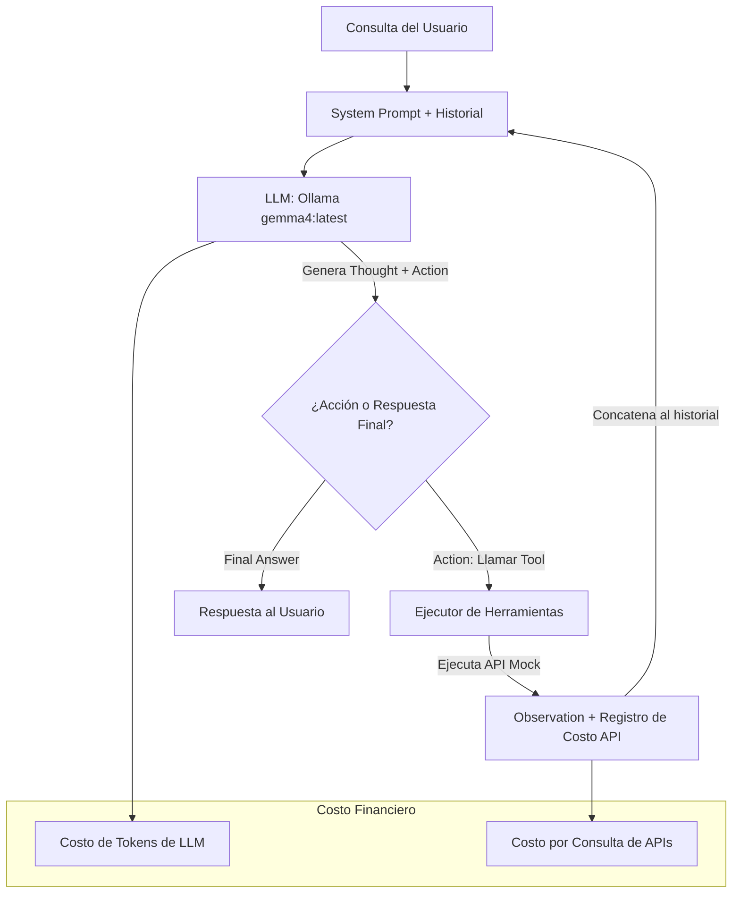

# Agente de Gestión de Pedidos & Suite de Evaluaciones (Evals) 🛍️

Este es un proyecto educativo de nivel avanzado diseñado para enseñar los fundamentos de **Sistemas Agentic, Arquitectura Planner + Executor, Validación de Herramientas y Evaluaciones de Agentes (Evals)**. 

El sistema consta de un agente de e-commerce especializado en la venta y recomendación de laptops que utiliza un flujo ReAct (Reason + Action) orquestado con **LangChain** y el modelo local **gemma4:latest (vía Ollama)**. Incluye un simulador de costos financieros para evidenciar cómo los errores de lógica, bucles infinitos y reintentos redundantes se traducen en un costo económico real.

---

## 🏗️ Arquitectura del Agente

El agente opera bajo un bucle ReAct clásico con memoria de contexto estructurada:



---

## 📚 Temario Cubierto (Módulo 6)

1. **6.1. Introducción a sistemas agentic**: Qué es un agente (LLM + System Prompt + Tools).
2. **6.2. Arquitectura: planner + executor**: Un bucle estructurado de razonamiento que planea la siguiente acción basada en observaciones previas.
3. **6.3. Validación de uso de herramientas**: Validación de tipos de datos de los argumentos (ej: `product_id` como entero) y manejo de excepciones de llamada.
4. **6.4. Workflows multi-paso**: Ejecución secuencial lógica de herramientas (Ej: `buscar_producto` -> `buscar_stock` -> `calcular_envio`).
5. **6.5. Manejo de memoria y contexto**: Mantener el historial de la conversación en formato de mensajes de LangChain para responder consultas de seguimiento.
6. **6.6. Evaluación de razonamiento multi-hop**: Resolver consultas que requieren buscar, filtrar, cotizar y comprar de forma coordinada comparando precios e inventario.
7. **6.7. Integración con RAG (agentic RAG)**: Una herramienta de consulta de políticas basada en pasajes relevantes de texto para responder preguntas administrativas.
8. **6.8. Validación de selección de herramientas**: Pruebas de selección óptima de herramientas según la intención de la consulta.
9. **6.9. Evaluación de consistencia de respuestas**: Historial de corridas para evaluar consistencia semántica y de costos.
10. **6.10. Pruebas de fallo, fallback y recuperación**: Simulación de errores de servidor (500) en el proveedor de envíos para evaluar la tolerancia al fallo del agente.
11. **6.11. Métricas: task completion, tool correctness**: Cálculo de métricas avanzadas (TCR, TCA, Costos Financieros promedio, Latencia).

---

## 🛠️ Herramientas Disponibles (APIs Mocks)

| Nombre | Parámetros | Descripción | Costo API (USD) |
| :--- | :--- | :--- | :--- |
| `buscar_producto` | `query: str` | Busca laptops que coincidan con la búsqueda. | $0.002 |
| `buscar_stock` | `product_id: int` | Consulta el stock actual de un producto por ID. | $0.001 |
| `calcular_envio` | `product_id: int`, `cp: str` | Cotiza costo exprés ($25 USD) y tiempo de entrega. | $0.005 |
| `calcular_descuento` | `product_id: int`, `coupon_code: str` | Aplica cupones (`DESCUENTO10`, `BIENVENIDA`). | $0.002 |
| `consultar_politicas` | `pregunta: str` | RAG basado en palabras clave sobre políticas de tienda. | $0.003 |

---

## 💲 Modelo de Costos Financieros

El proyecto demuestra que **los errores de los agentes cuestan dinero**. Los costos se calculan sumando el consumo de tokens y los cobros por consultas a APIs:

* **Costo de Tokens de Entrada**: $2.00 USD por cada 1,000,000 de tokens.
* **Costo de Tokens de Salida**: $6.00 USD por cada 1,000,000 de tokens.
* **Costo de API**: Tarifa fija por llamada de herramienta (detallada en la tabla superior).
* Si un agente entra en un bucle infinito o comete errores de formato que requieren repetir llamadas, el costo financiero se dispara, lo cual se visualiza en los gráficos del Dashboard de Evals.

---

## 🚀 Instrucciones de Instalación y Uso

### Prerrequisitos

1. Tener instalado [Ollama](https://ollama.com/) en tu equipo.
2. Tener descargado el modelo `gemma4:latest` (o configurar el modelo de tu preferencia en Ollama).
   ```bash
   ollama run gemma4:latest
   ```

### Configuración del Proyecto

1. **Clonar/Abrir el directorio del proyecto**:
   ```bash
   cd c:\Users\Uriel\Desktop\Python\Evals\Proyecto_04
   ```

2. **Crear y activar el entorno Conda**:
   ```bash
   # (Opcional si se creó automáticamente)
   conda activate evals_proyecto04
   ```

3. **Instalar dependencias**:
   ```bash
   pip install -r requirements.txt
   ```

### Ejecutar la Aplicación Streamlit

Para iniciar la interfaz interactiva con el chat en vivo y el dashboard de métricas:

```bash
streamlit run app.py
```

La aplicación se abrirá automáticamente en tu navegador por defecto (usualmente en `http://localhost:8501`).

### Ejecutar las Evaluaciones por Consola

Si prefieres correr la suite de evals directamente en la terminal sin la interfaz web:

```bash
python src/evaluator.py
```

---

## 📈 Dashboard de Métricas en Streamlit

El frontend construido en Streamlit cuenta con tres secciones principales:
1. **💬 Chat con el Agente**: Espacio para interactuar en tiempo real con el agente y ver en vivo su "pensamiento interno" (Reasoning Steps), el orden en el que ejecuta las herramientas y el costo total acumulado del chat.
2. **📊 Dashboard de Evals**: Una interfaz para correr la suite de pruebas completa, ver KPI cards y gráficos dinámicos interactivos sobre:
   * **Distribución de costos**: Comparativa de cuánto gastamos en APIs vs. cuánto en tokens del LLM.
   * **Relación Costo vs. Estado**: Gráfico de barras de qué escenarios fueron más costosos y si terminaron exitosamente o no.
   * **Tendencias Históricas**: Seguimiento temporal de la Tasa de Completitud (TCR) a medida que optimizas el prompt o las herramientas del agente.
3. **🗄️ Base de Datos & Políticas**: Vista de la base de datos de productos (laptops) y políticas de tienda. Te permite editar el stock en tiempo real (ej: agotar un producto) para validar si el agente cambia su comportamiento al instante.
